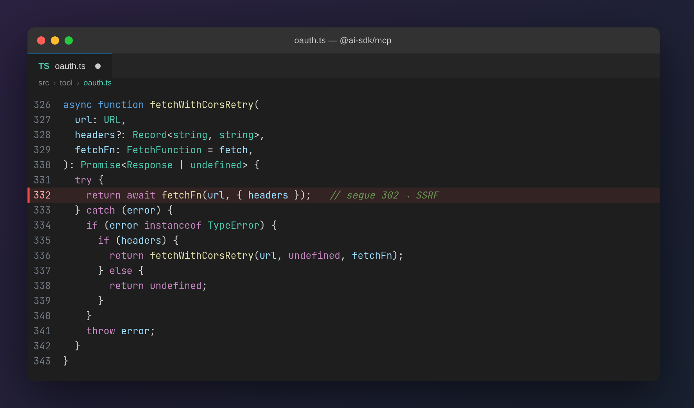

# SSRF no `@ai-sdk/mcp` via redirect no discovery de OAuth

> **Resumo:** um servidor MCP malicioso consegue forçar o processo Node da aplicação **vítima** a fazer requisições HTTP para endereços internos escolhidos pelo atacante (loopback, RFC1918, link-local, metadata de cloud). A falha está no fluxo de *discovery* de metadata OAuth da biblioteca [`@ai-sdk/mcp`](https://www.npmjs.com/package/@ai-sdk/mcp): os `fetch` desse fluxo **seguem redirecionamentos `302`** e **não bloqueiam destinos internos**, ao contrário do transporte HTTP/SSE — que já usa `redirect: 'error'` justamente *"to prevent SSRF"*.

| | |
|---|---|
| **Pacote afetado** | `@ai-sdk/mcp` (código em `packages/mcp`) |
| **Versões testadas** | `2.0.21` / `2.0.32` |
| **Classe** | SSRF — CWE-918 (relacionado: CWE-601, *Open Redirect*) |
| **Vetor** | Server-Side Request Forgery cego / side-effect a partir do host da vítima |
| **Requisito** | A vítima conecta a um MCP com `authProvider` configurado (fluxo OAuth) |

---

## 1. Contexto: por que o discovery de OAuth é um alvo

O protocolo MCP (*Model Context Protocol*) permite que uma aplicação (a **vítima**) conecte-se a servidores MCP para expor *tools* a um modelo. Quando o servidor MCP exige autenticação, ele responde `401`, e o SDK da vítima inicia o **OAuth discovery**: busca a metadata em endpoints `/.well-known/*` para descobrir o *authorization server*, e pode ainda executar **Dynamic Client Registration (DCR)** — um `POST` no `registration_endpoint` anunciado por essa metadata.

O problema: **quem controla o servidor MCP controla essas respostas**. Basta um usuário registrar uma URL de MCP maliciosa numa aplicação multi-tenant (ou um dev conectar em um MCP "de teste") para que a vítima passe a seguir as ordens do atacante durante o discovery.

## 2. A causa raiz

O fluxo de discovery usa a função `fetchWithCorsRetry`, que faz o `fetch` **sem** `redirect: 'error'` e **sem** nenhuma validação do destino (não bloqueia `127.0.0.1`, faixas RFC1918, link-local `169.254.0.0/16`, IPv6 loopback etc.):



A linha destacada é o coração da falha:

```ts
// oauth.ts — fetchWithCorsRetry
return await fetchFn(url, { headers });   // sem redirect:'error' → segue o 302
```

O `fetch` padrão do Node segue redirecionamentos automaticamente (`redirect: 'follow'`). Assim, se a resposta a um `/.well-known/...` for um `302 Location: http://127.0.0.1:PORT/interno`, o processo da vítima **segue** esse redirect e bate no alvo interno.

Vale notar o contraste: a própria [documentação do AI SDK](https://ai-sdk.dev/docs/ai-sdk-core/mcp-tools) afirma que o transporte HTTP/SSE usa `redirect: 'error'` *"to prevent SSRF"*. Essa proteção **não** foi aplicada ao fluxo de discovery de OAuth.

### Por que as "proteções" existentes não pegam

- **`SafeUrlSchema`** só rejeita esquemas `javascript:`, `data:` e `vbscript:` — não bloqueia `http://` para IPs internos.
- **Checagens de *issuer* / *same-origin*** e o hook opcional **`validateAuthorizationServerURL`** rodam sobre *strings* de URL **antes** do request — e não inspecionam o destino **após** o `302`, nem os IPs internos que aparecem dentro do `registration_endpoint`/`token_endpoint` da metadata. Ou seja: mesmo com o hook documentado ativo, o SSRF via `Location` continua funcionando.

## 3. Dois caminhos de exploração

| Caminho | Método | Onde | Efeito |
|--------|--------|------|--------|
| **A — Redirect no discovery** | `GET` | `fetchWithCorsRetry` (discovery) | Segue o `302` até uma URL interna → GET arbitrário |
| **B — DCR / token** | `POST` | `registerClient` / token endpoint | `POST` arbitrário para `registration_endpoint`/`token_endpoint` internos da metadata |

O impacto é predominantemente **cego** (*blind SSRF*) ou de **side-effect** (dispara ações em endpoints internos que reagem a um GET/POST). A leitura da resposta pelo atacante (*read-back*) é **condicional**: em erros não-2xx, `parseErrorResponse` pode embutir o corpo em `MCPClientOAuthError.message` (`Raw body: …`), mas isso só vaza para o atacante se a aplicação expuser `err.message`. Por isso a severidade sugerida é **baixa** — é SSRF comprovado, não RCE nem exfiltração confiável.

## 4. Passo a passo da exploração (lab)

O lab em [`poc/`](poc/) reproduz o **Caminho A** com três atores em uma mesma máquina (em um ataque real, vítima e atacante estariam em hosts distintos):

- **`poc/vitima/internal-target.mjs`** — serviço que deveria ser **só interno** (representa uma admin API em `127.0.0.1`, o *metadata service* da cloud, etc.). Responde `SECRET-INTERNAL-DATA`.
- **`poc/attacker/attacker-mcp.mjs`** — o **MCP malicioso**. Responde `401` no tráfego MCP normal (para disparar o discovery) e `302 Location: <URL interna>` em qualquer `/.well-known/*`.
- **`poc/vitima/victim-client.mjs`** — a **aplicação vítima**, usando `@ai-sdk/mcp`. Ela apenas "conecta" na URL do MCP do atacante.

### Fluxo do ataque

```
  vítima (@ai-sdk/mcp)            atacante (MCP malicioso)        alvo interno
        │                                  │                          │
        │  1. conecta ao MCP  ───────────► │                          │
        │  2. ◄──────────────────  401 WWW-Authenticate: Bearer       │
        │  3. GET /.well-known/... ──────► │                          │
        │  4. ◄────────  302 Location: http://127.0.0.1/interno       │
        │  5. segue o 302 (GET) ───────────────────────────────────► │
        │                                  │       6. >>> HIT <<< ◄────┤
```

O SDK, ao receber o `401` (passo 2), inicia o discovery (passo 3). O atacante responde com um `302` apontando para o alvo interno (passo 4), e o `fetch` da vítima **segue** esse redirect (passo 5), atingindo um serviço que jamais deveria receber tráfego externo (passo 6).

### Reproduzindo

Requer **Node.js >= 22**. Em três terminais, na pasta `poc/`:

**Terminal 1 — sobe o alvo interno (lado vítima):**
```bash
cd poc/vitima
npm install
node internal-target.mjs
# anote o valor impresso de INTERNAL_URL, ex.: http://127.0.0.1:41xxx/internal?probe=ssrf
```

**Terminal 2 — sobe o MCP malicioso (lado atacante), apontando o redirect para o alvo interno:**
```bash
cd poc/attacker
INTERNAL_URL='http://127.0.0.1:PORT/internal?probe=ssrf' node attacker-mcp.mjs
# anote o valor impresso de MCP_URL, ex.: http://127.0.0.1:38xxx
```

**Terminal 3 — a vítima "conecta" no MCP do atacante:**
```bash
cd poc/vitima
MCP_URL='http://127.0.0.1:PORT' node victim-client.mjs
```

**Resultado esperado (PASS):** no Terminal 1 aparece `>>> HIT <<<` — o processo da vítima fez um GET no alvo interno **sem que a aplicação jamais tenha pedido isso**. O SSRF está confirmado. É comum a vítima terminar com um erro *depois* do HIT (o alvo interno não fala OAuth), o que não invalida a exploração — o request já saiu.

### Demonstração


## 5. Mitigações

Para quem mantém código que faz discovery/registro OAuth (ou usa o SDK):

1. **Não seguir redirects** nos fetches de discovery: usar `redirect: 'error'` (ou `'manual'` + validação explícita do destino), como já é feito no transporte HTTP/SSE.
2. **Bloquear destinos internos** em *todos* os fetches OAuth: loopback, RFC1918, link-local e seus equivalentes IPv6 — conforme recomenda a [RFC 9728 §7.7](https://www.rfc-editor.org/rfc/rfc9728). A validação deve ocorrer **após** resolver o destino final (pós-redirect) e também sobre os endpoints anunciados na metadata (`registration_endpoint`, `token_endpoint`).
3. **Não embutir o corpo completo** da resposta nas mensagens de erro (`parseErrorResponse`), para reduzir o canal de *read-back*.
4. **Não tratar `validateAuthorizationServerURL` como mitigação suficiente** — ele não cobre o redirect nem os IPs internos da metadata.

## 6. Aviso

Este material é publicado **exclusivamente para fins educacionais, de pesquisa e defesa**, e deve ser usado apenas em ambientes próprios ou com autorização. O objetivo é compartilhar conhecimento e aumentar a segurança dos sistemas. Qualquer uso indevido não é recomendado e é de responsabilidade exclusiva de quem o realiza.

---

*Pesquisa por [Fernando Bortotti](https://github.com/fernandobortotti) · [Crônicas de Hacknagem](https://fernandobortotti.github.io/artigos/)*
